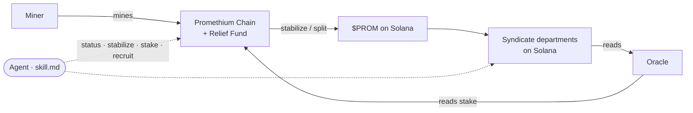

# Architecture

The chain, three programs, and the Syndicate that runs on top.

## The Node — Promethium Chain

A Bitcoin-codebase fork. It validates blocks and transactions, enforces Proof-of-Work and the 21M cap, runs the **decay** on surfaced promethium, routes decayed slices into the **Relief Fund** at stabilization time, and applies each miner's difficulty discount.

## The Miner

Standard SHA-256 mining — CPU, GPU, ASIC, solo or pool. Finds blocks, earns PROMETHIUM.

## The Oracle

Reads Solana and reports to the chain:

- **R&D Institute** stake -> your tools discount (up to 3x)
- **Recruitment Office** crew -> your labour discount (up to 2x)
- **Relief Fund** deposit -> your share of interest

## The Syndicate departments

- **Stabilization Plant** — decants surfaced PROMETHIUM into $PROM; sends decay to the Relief Fund.
- **R&D Institute** / **Recruitment Office** — the two difficulty levers (tools, labour).
- **Relief Fund** — pays $PROM interest from captured decay.
- **Hiring Hall** — pay a PMS miner to dig for you.

## How it fits

The agent sits on top of all of it: it reads status, stabilizes, stakes, and recruits through one `skill.md`.

Next: **Get Started**.
