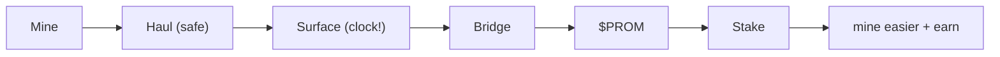

# Get Started

Five steps. (Downloads and addresses go live on **minecoins.work**.)

## 1 · Mine

Grab the node + miner. Make an address. Point your CPU / GPU / ASIC at Promethium Chain (or a pool) and start hashing. It's SHA-256, so Bitcoin gear works as-is.

## 2 · Haul (just wait)

Mined promethium takes **100 blocks** to surface. It's safe the whole time — nothing decays. Grab a coffee.

## 3 · Bridge before it fades

The moment it surfaces, the **17.7h** clock starts.

1. Send a PROMETHIUM transfer to the bridge address.
2. Attach an `OP_RETURN` with your Solana address.
3. Receive **$PROM** automatically (minus 2% + 1 USDC x402). Decay stops.

> Don't bridge in time and your promethium drains into the **Battery** — feeding the stakers.

## 4 · Stake (two pools)

With $PROM on Solana:

- **Difficulty Pool** → mine up to **3× easier**.
- **Battery Pool** → earn PROMETHIUM yield from everyone else's decay.

Each stake/unstake is 1 USDC via x402.

## 5 · Go agentic

Load the `skill.md` into Claude and just say what you want — *"bridge what surfaced, stake half in each pool."* The agent runs the loop and beats the clock for you.

## The whole thing

Next: **FAQ**.
