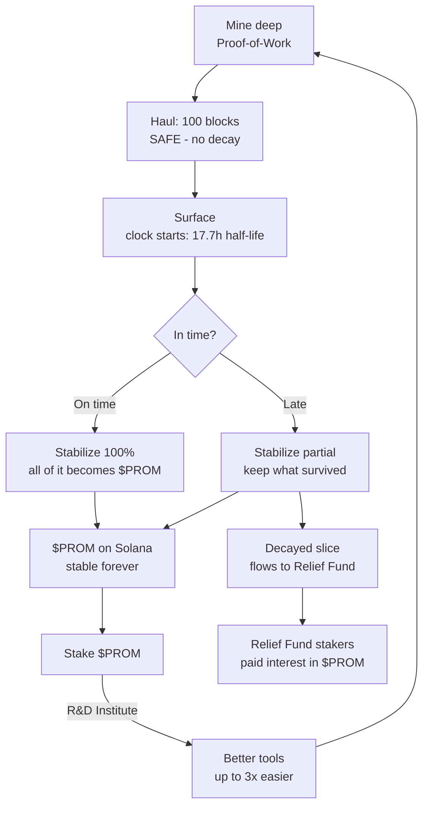

# The Loop

Everything in Promethium is one loop. Here it is, end to end:

## Step by step

1. **Mine deep.** Real Proof-of-Work pulls promethium out of Promethium Chain.
2. **Haul it up.** 100 blocks to the surface. During the haul it's *safe* — nothing decays. You just can't move it yet.
3. **The clock starts.** At the surface, promethium decays — half-life **17.7 hours**.
4. **Stabilize.** You always run it through the **Stabilization Plant**. The Plant checks how long it sat at the surface:
   - **On time** -> you keep ~100%, all of it becomes **$PROM**.
   - **Late** -> you keep what survived as **$PROM**; the decayed slice settles into the **Relief Fund**.
5. **The decayed slice pays stakers.** Whatever you lost isn't destroyed — it becomes interest paid out to Relief Fund stakers, in **$PROM**.

## You don't lose it all — you lose a slice

This isn't all-or-nothing. Stabilize fast and you keep nearly everything. Wait a while and you keep less — the decayed slice goes to the Relief Fund. **Speed = how much you keep.**

## And it feeds itself

Stake **$PROM** in the **R&D Institute** and you get better tools — mine up to **3x easier** next time. Recruit miners through the **Recruitment Office** for up to **2x** more on top. Save more, stake more, dig faster.

Next: **Promethium & Decay**.
