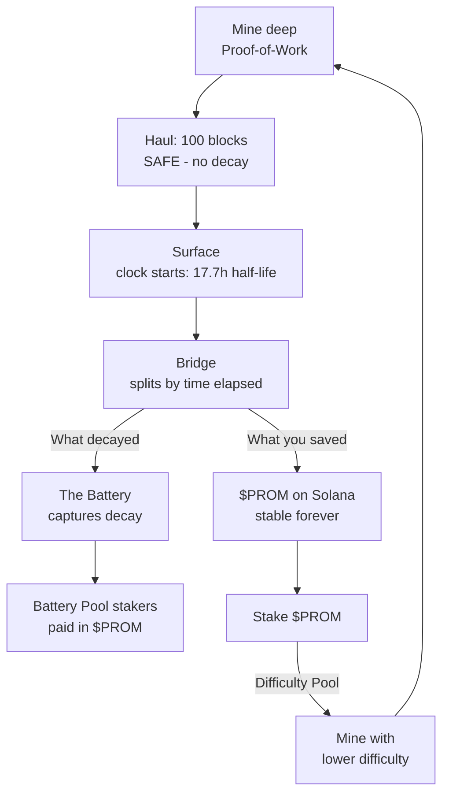

# The Loop

Everything in Promethium is one loop. Here it is, end to end:

## Step by step

1. **Mine deep.** Real Proof-of-Work pulls promethium out of Promethium Chain.
2. **Haul it up.** 100 blocks to reach the surface. During the haul it's *safe* — nothing decays. You just can't move it yet.
3. **The clock starts.** At the surface, promethium decays — half-life **17.7 hours**. Every hour you wait, a little more slips away.
4. **Bridge — always.** Bridging is the next step no matter what. The Bridge looks at how long your promethium sat at the surface and splits the result two ways.
5. **What you saved -> $PROM.** The portion that survived the wait lands on Solana as **$PROM** — stable, permanent, done decaying.
6. **What decayed -> the Battery.** Whatever slipped away while you waited isn't destroyed — it flows into the **Battery** and gets paid out to stakers.

## You don't lose it all — you lose a slice

This isn't all-or-nothing. Bridge instantly and you keep ~100%. Wait a while and you keep less — the decayed slice goes to the Battery. The longer you sit, the bigger the slice you hand over. **Speed = how much you keep.**

## Nothing is destroyed — it just changes hands

Promethium is *conserved*. The part you let decay doesn't vanish from the universe; it powers the Battery and pays out to stakers as **$PROM**. The diligent are quietly paid by the slow.

## And it feeds itself

Stake **$PROM** and you mine easier next time (up to **3x**). Save more, stake more, dig faster. The safe side fuels the hungry side.

Next: **Promethium & Decay**.
