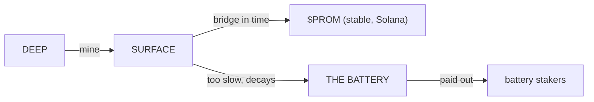

# The Loop

Everything in Promethium is one loop. Here it is, end to end:

## Step by step

1. **Mine deep.** Real Proof-of-Work pulls promethium out of Promethium Chain.
2. **Haul it up.** 100 blocks to reach the surface. During the haul it's *safe* — nothing decays. You just can't move it yet.
3. **The clock starts.** At the surface, promethium decays — half-life **17.7 hours**. Wait too long and it slips away.
4. **Bridge to survive.** Send it across to Solana and it freezes solid as **$PROM**. Decay stops on arrival.
5. **Or lose it to the Battery.** Whatever you let decay doesn't burn — it drains into the Battery and gets handed to people who stake.

## Nothing is destroyed — it just changes hands

Promethium is *conserved*. The promethium you fail to save doesn't vanish from the universe; it powers the Battery and pays out to stakers as fresh PROMETHIUM (which surfaces and starts decaying all over again). The element never stops moving. The diligent are paid by the slow.

## And it feeds itself

Stake **$PROM** and you mine easier next time (up to **3×**). Save more, stake more, dig faster. The safe side fuels the hungry side.

Next: **Promethium & Decay**.
